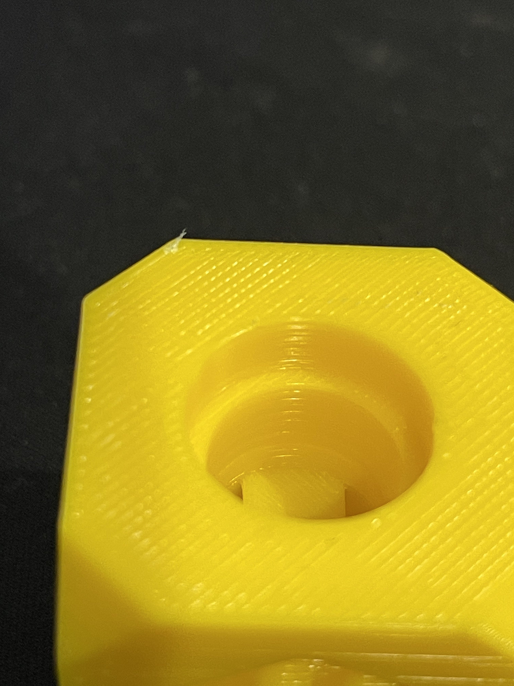

# Filament Calibration

Looking at the top left of the cube you can see hatch marks (#) and what looks like tiny marks through the extrusion lines. This is actually the next layer being visible; the top layer is under extruded.

